# Домашнее задание к занятию "`Введение в Terraform`" - `Кочнев Андрей`

### Инструкция по выполнению домашнего задания

   1. Сделайте `fork` данного репозитория к себе в Github и переименуйте его по названию или номеру занятия, например, https://github.com/имя-вашего-репозитория/git-hw или  https://github.com/имя-вашего-репозитория/7-1-ansible-hw).
   2. Выполните клонирование данного репозитория к себе на ПК с помощью команды `git clone`.
   3. Выполните домашнее задание и заполните у себя локально этот файл README.md:
      - впишите вверху название занятия и вашу фамилию и имя
      - в каждом задании добавьте решение в требуемом виде (текст/код/скриншоты/ссылка)
      - для корректного добавления скриншотов воспользуйтесь [инструкцией "Как вставить скриншот в шаблон с решением](https://github.com/netology-code/sys-pattern-homework/blob/main/screen-instruction.md)
      - при оформлении используйте возможности языка разметки md (коротко об этом можно посмотреть в [инструкции  по MarkDown](https://github.com/netology-code/sys-pattern-homework/blob/main/md-instruction.md))
   4. После завершения работы над домашним заданием сделайте коммит (`git commit -m "comment"`) и отправьте его на Github (`git push origin`);
   5. Для проверки домашнего задания преподавателем в личном кабинете прикрепите и отправьте ссылку на решение в виде md-файла в вашем Github.
   6. Любые вопросы по выполнению заданий спрашивайте в чате учебной группы и/или в разделе “Вопросы по заданию” в личном кабинете.

Желаем успехов в выполнении домашнего задания!

### Дополнительные материалы, которые могут быть полезны для выполнения задания

1. [Руководство по оформлению Markdown файлов](https://gist.github.com/Jekins/2bf2d0638163f1294637#Code)

---

### Задание 1

Сохранить личную, секретную информацию можно в файле personal.auto.tfvars

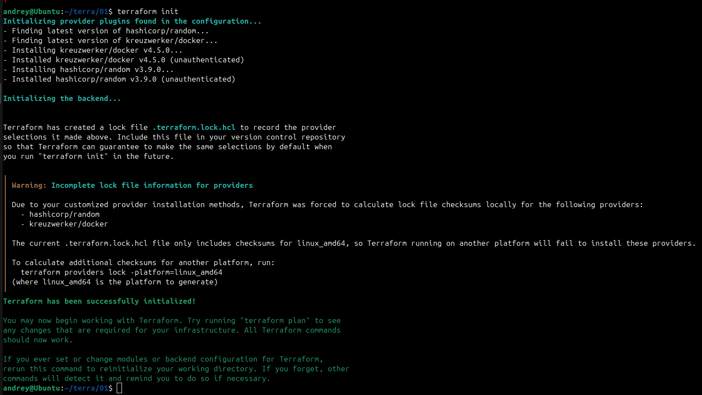

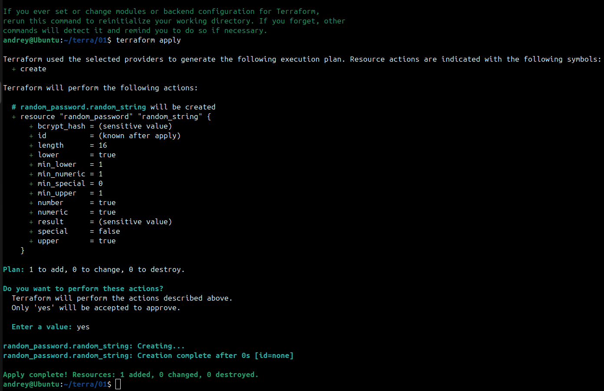

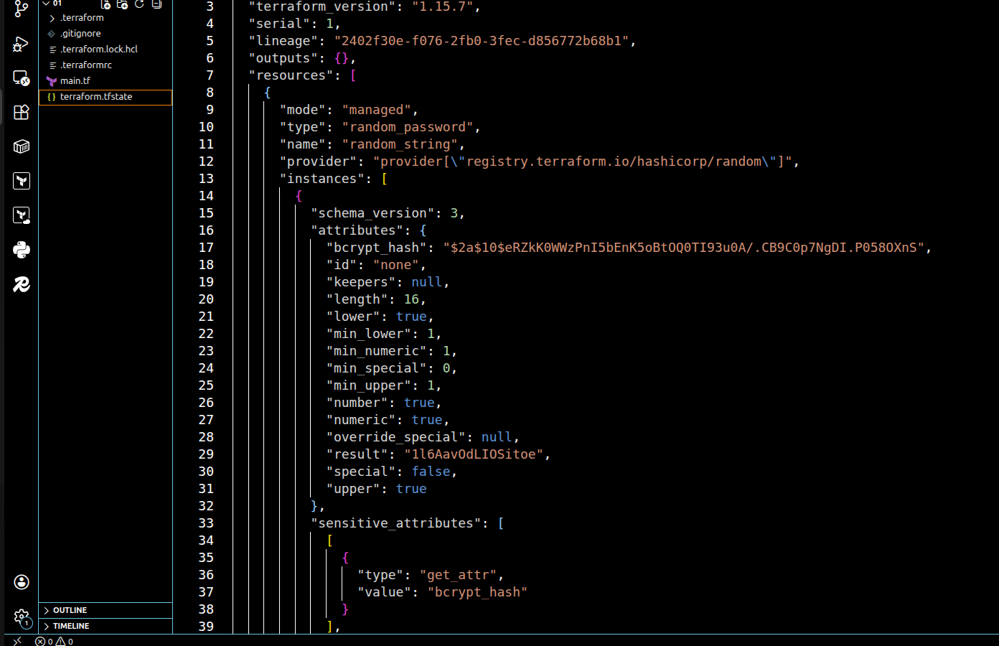

Значение пароля - 1l6AavOdLIOSitoe

В коде допущены были как синтаксические ошибки:

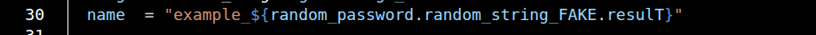

Так и отсвствует имя ресурса

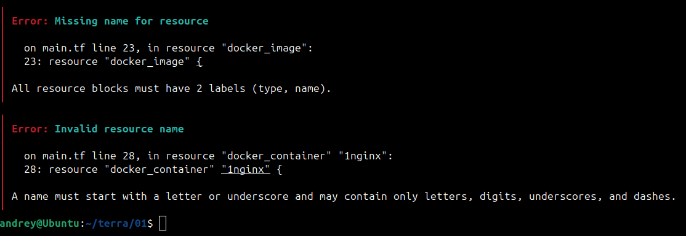

Исправленная версия кода:

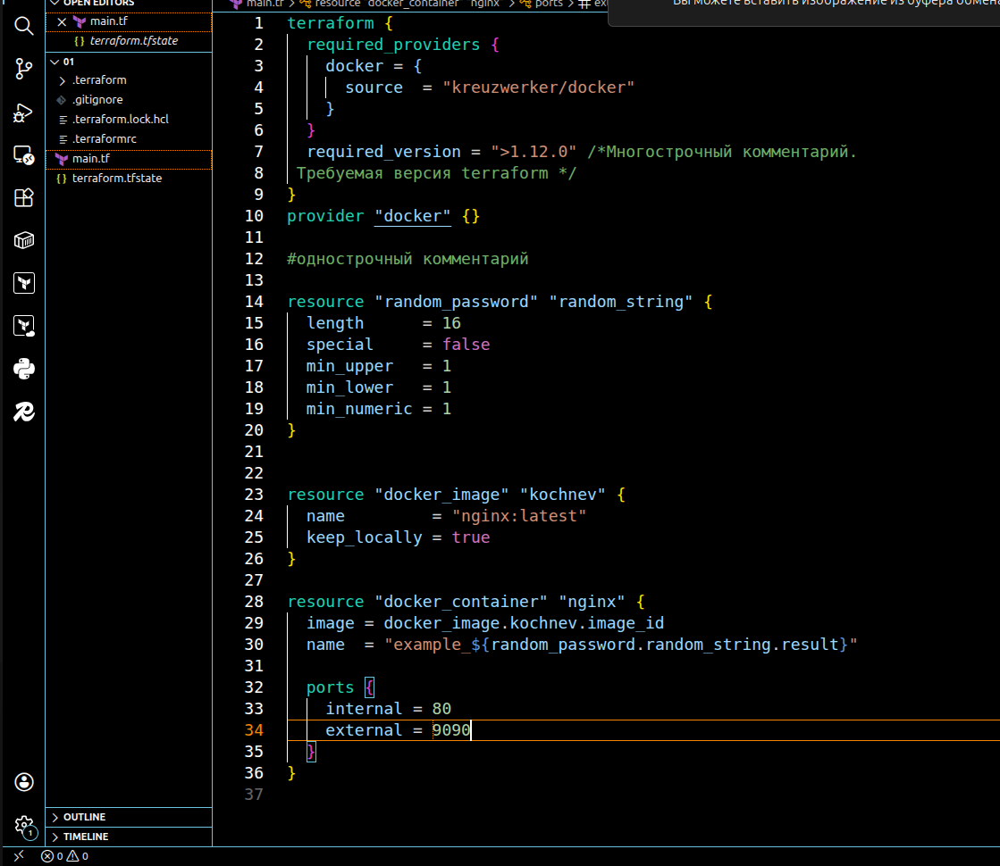

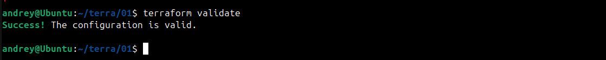

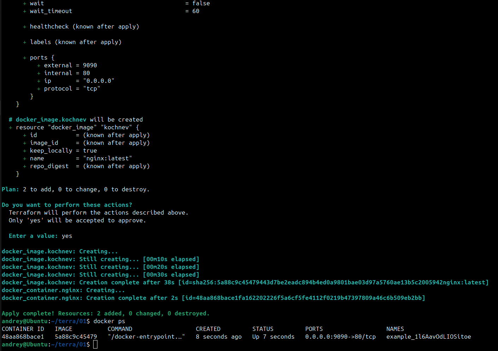

Имя изменено:

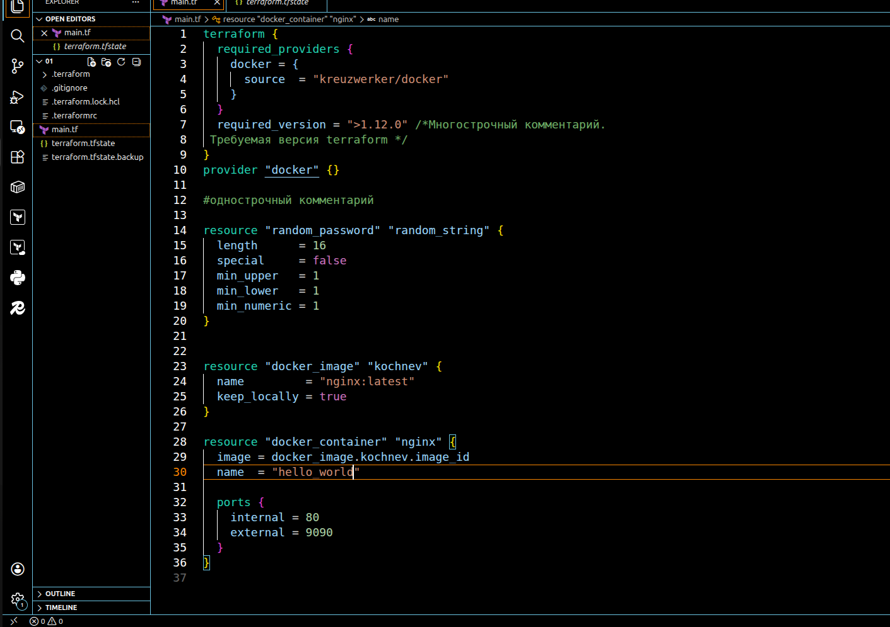

В результате после применения команды terraform apply -auto-approve контейнер был заменен

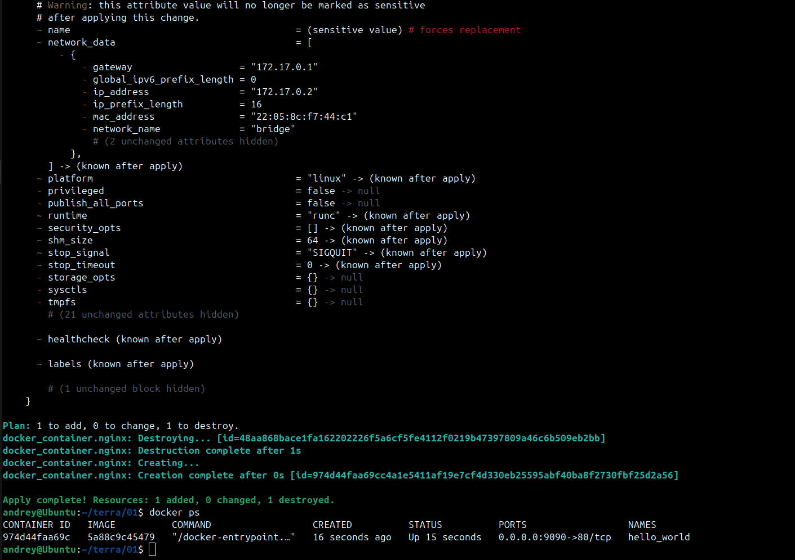

Использование этого ключа опасно тем, что код выполняется без подтверждения выполняемых по плану действий. Это опасно если код не до конца проработан (удаоение ресурсов, простои, потери данных и т.д.). Но также и необходим когда - например для автоматических пайпланов, повторяемых деплоев или тестовых сред.

Ресурсы удалены:

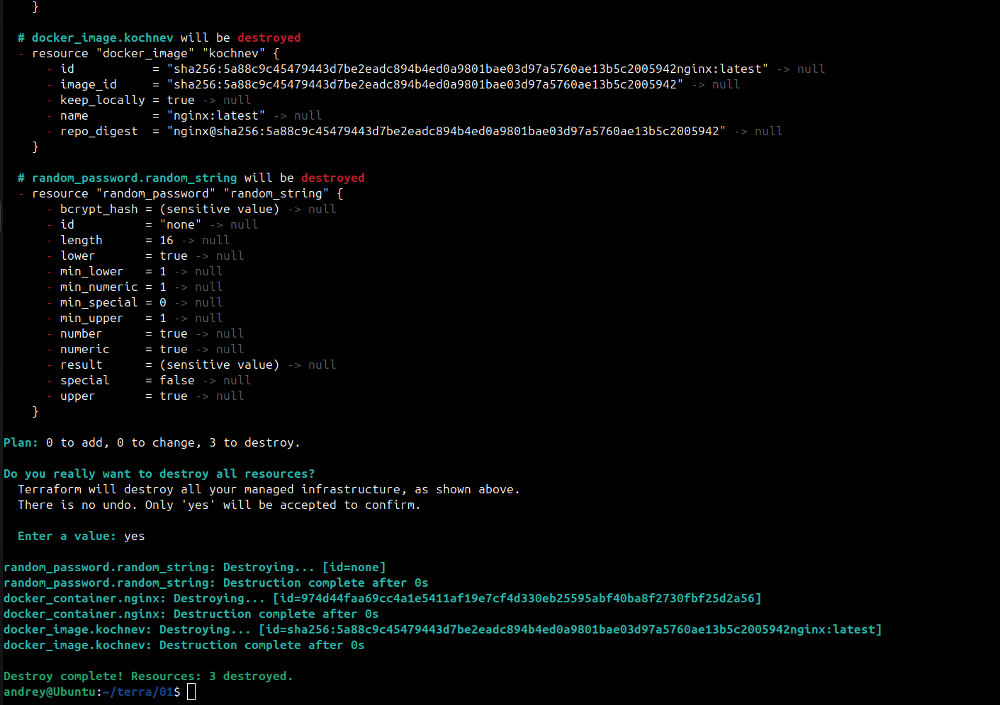

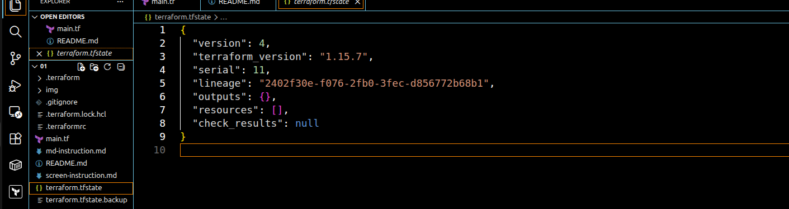

Образ не удален потому что в коде есть строчка:
 keep_locally = true

по этому поводу в документации сказано что:

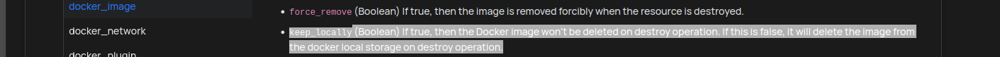

То есть оставляет образ при значении true
---

### Задание 2

---
